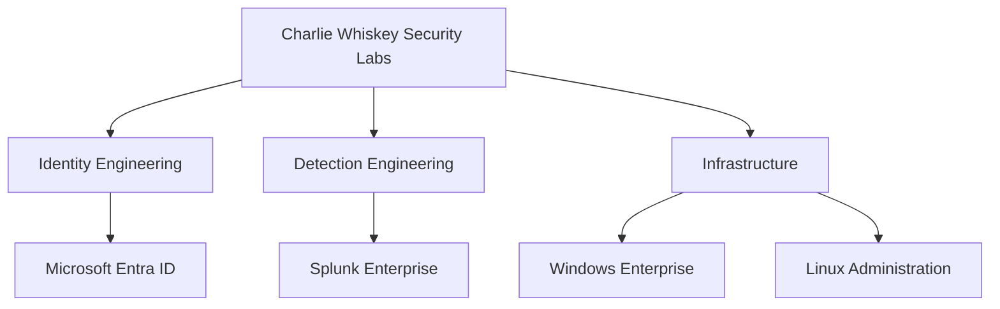

  

# 👋 Hi, I'm Chris Woodard (CharlieWhiskey)

**Security Engineer focused on Identity Security, Detection Engineering, and Microsoft technologies.**

I'm building **Charlie Whiskey Security Labs (CWSL)**—a fictional enterprise environment designed to simulate real-world identity infrastructure, security operations, detection engineering, and enterprise administration.

Rather than completing isolated labs, I'm engineering an environment where every project contributes to a larger enterprise security story.

---

## 🏢 Charlie Whiskey Security Labs

Charlie Whiskey Security Labs is my continuously evolving security engineering portfolio.

Within CWSL, I design, secure, monitor, and document a modern enterprise while developing hands-on experience with technologies used by today's security teams.

### Current Areas of Focus

- 🔐 Microsoft Entra ID & Identity Security
- 📊 Splunk Enterprise & Detection Engineering
- 🖥️ Windows Enterprise Administration
- 🐧 Linux Administration
- 🚨 Security Monitoring & Incident Investigation
- 📖 Enterprise Documentation

---

## 🗺️ Enterprise Architecture

---

## 🚀 Featured Repositories

| Repository | Description |
|------------|-------------|
| 🏢 **[Charlie Whiskey Security Labs](https://github.com/CharlieWhiskeySec/charlie-whiskey-security-labs)** | Enterprise hub connecting every project within CWSL |
| 🔐 **[Microsoft Entra ID](https://github.com/CharlieWhiskeySec/entra-id)** | Identity administration, Conditional Access, MFA, RBAC, and Microsoft cloud security |
| 📊 **[Splunk Enterprise](https://github.com/CharlieWhiskeySec/splunk-detections)** | Detection engineering, Windows Event Logs, SPL development, and enterprise monitoring |
| 🐧 **[Linux Administration](https://github.com/CharlieWhiskeySec/linux-administration)** | Linux fundamentals, administration, automation, and enterprise server management |
| 👁️ **[Whiskey's Watch](https://github.com/CharlieWhiskeySec/whiskeys-watch)** | Cybersecurity news, enterprise insights, and hands-on lab writeups |

---

## 📡 Latest Mission Updates

- ✅ Built Microsoft Entra ID enterprise tenant
- ✅ Implemented Conditional Access policy lab
- ✅ Built enterprise Active Directory environment
- ✅ Publishing weekly Whiskey's Watch SITREPs
- 🚧 Expanding identity-focused detection engineering portfolio

---

## 🎯 Career Focus

I'm currently pursuing opportunities in:

- Identity Engineering
- Detection Engineering
- Security Engineering
- Microsoft Security
- IAM / Entra Administration
- SIEM Engineering

---

## 🛠️ Technologies

### Identity & Access Management

- Microsoft Entra ID
- Active Directory
- Conditional Access
- Multi-Factor Authentication (MFA)
- Role-Based Access Control (RBAC)

### Security Operations

- Splunk Enterprise
- Windows Event Logs
- Detection Engineering
- Security Monitoring
- Incident Investigation

### Infrastructure

- Windows Server
- Windows 11 Enterprise
- Ubuntu Server
- Linux
- VirtualBox

### Documentation

- GitHub
- Markdown
- Mermaid
- Technical Documentation

---

## 📜 Certifications

- ✅ CompTIA Security+
- ✅ Microsoft SC-900
- ✅ Microsoft AZ-900
- ✅ Splunk Core Certified User
- ✅ ISC2 Certified in Cybersecurity (CC)
- ✅ Google Cybersecurity Professional Certificate

---

## 🤝 Connect

💼 **LinkedIn**  
https://www.linkedin.com/in/clwoodard/

💻 **GitHub**  
https://github.com/CharlieWhiskeySec

---

> *"Building practical security engineering experience one enterprise project at a time."*
